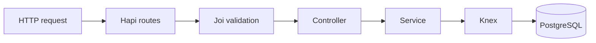

# TypeScript Hapi Items API

[](https://github.com/AEVegaEngineer/typescript-hapi-items-api/actions/workflows/test.yml)
[](LICENSE)

A compact REST API that demonstrates layered TypeScript service design with Hapi, PostgreSQL, Knex, Joi validation, containerized development, and end-to-end tests.

## Capabilities

- Health check
- Create, list, retrieve, update, and delete items
- Request and route-parameter validation
- Structured validation errors
- PostgreSQL persistence
- End-to-end HTTP tests using Hapi's in-process injection API

## Architecture



The route layer owns HTTP concerns, controllers translate requests and responses, services implement item operations, and the database adapter isolates PostgreSQL configuration.

## Run locally

Requirements:

- Node.js 20 or newer
- Docker

```bash
cp .env.example .env
docker compose up -d db
npm ci
npm run dev
```

The API listens on http://localhost:3000. PostgreSQL is exposed on host port 5434 by default to avoid colliding with a local PostgreSQL installation.

## API

| Method | Path | Purpose |
| --- | --- | --- |
| GET | /ping | Health check |
| GET | /items | List items |
| POST | /items | Create an item |
| GET | /items/{id} | Retrieve an item |
| PUT | /items/{id} | Update an item |
| DELETE | /items/{id} | Delete an item |
| DELETE | /items | Clear items for local/test use |

Example:

```bash
curl --request POST http://localhost:3000/items \
  --header 'Content-Type: application/json' \
  --data '{"name":"Mechanical keyboard","price":120.50}'
```

## Verification

```bash
npm run typecheck
npm test
```

The GitHub Actions workflow starts an isolated PostgreSQL service, type-checks the project, and runs the end-to-end suite.

## Engineering decisions

- Hapi's server injection keeps HTTP tests fast without opening a network port.
- Joi validation runs before controllers, keeping invalid data out of the service layer.
- Database settings come from environment variables with safe local-development defaults.
- The schema bootstrap keeps this small example self-contained; a production service should use versioned migrations.

## Limitations

- There is no authentication or authorization.
- Schema creation is intentionally minimal and should be replaced by migrations as the domain grows.
- The bulk-delete route exists for local development and test cleanup; it should not be publicly exposed in production.

## License

MIT
